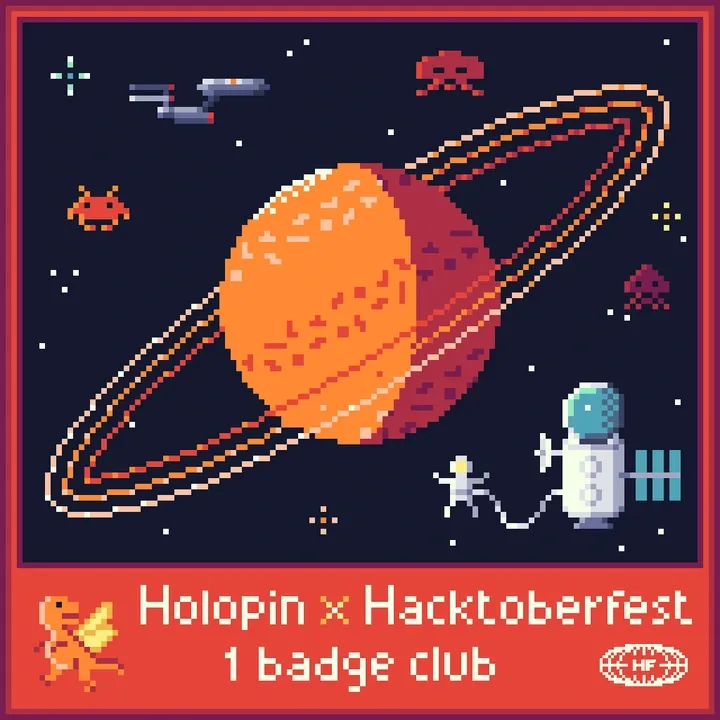
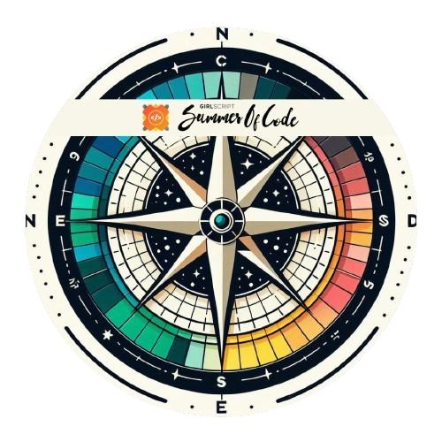
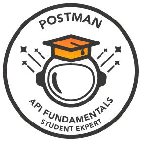
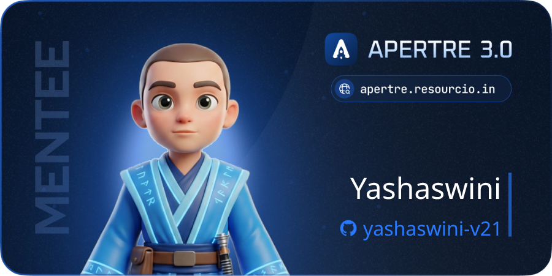

<div align="center">

  

  <br><br>

  [](https://linkedin.com/in/yashaswini21)
  [](https://github.com/Yashaswini-V21)
  [](mailto:yashasyashu0987@gmail.com)
  [](https://www.skills.google/public_profiles/343e3609-91f4-45fd-883c-e7276e87d427)
  [](https://www.skills.google/public_profiles/f35e42c9-34da-4d01-a0d7-396a591772b1)
  [](https://g.dev/yashaswini-v21)

</div>

---

## **`> about_me.py`**

```python
yashaswini = {
    "🎓": "Pursuing BCA | Data Science & AIML",
    "📊": "Passionate about Data Analysis & Visualization",
    "☁️": "Google Cloud Arcade Facilitator: Ranger (2025) | Legend (2026)",
    "🏆": "Apertre 3.0 Top 8 Finalist | GSSoC '25 Top 200 | 10+ Hackathons",
    "✍️": "Active Tech Blog Writer & Technical Content Creator",
    "🌱": "Currently learning Deep Learning & Cloud Computing",
    "🎯": "Target: Analytics Engineer & Cloud Data Engineer"
}
```

---

<p align="center"></p>

## **`> featured_work`**

<div align="center">

<!-- PROJECT 01: TalentPulse -->
<table width="100%" style="border-collapse: collapse; border: 1px solid #38bdf8; background-color: #0d1117; border-radius: 8px; overflow: hidden; text-align: left;">
<tr>
<td style="padding: 8px 16px; background-color: #0f172a; border-bottom: 1px solid #1e293b;">
<b style="color: #38bdf8; font-size: 11px; letter-spacing: 2px;">◈ 01 — DATA PRODUCT · NLP · DATA QUALITY</b>
</td>
</tr>
<tr>
<td style="padding: 22px;">

<h3 style="margin: 0 0 10px 0; color: #f8fafc; font-size: 20px;">🚀 TalentPulse — Talent Intelligence Engine</h3>

<p style="color: #94a3b8; font-size: 14px; margin: 0 0 18px 0; line-height: 1.6;">
An interactive Bengaluru talent-intelligence product that converts unstructured job descriptions into skill, company and salary insights.
</p>

<table width="100%" style="margin-bottom: 16px;">
<tr>
<td width="58%" valign="top">
<b style="font-size: 12px; color: #38bdf8;">⚙️ Technical Highlights</b>
<ul style="font-size: 13px; color: #cbd5e1; line-height: 1.8; margin-top: 6px; padding-left: 18px;">
<li>Custom NLP entity + vocabulary matching engine</li>
<li>Skill normalization across 200+ canonical synonyms</li>
<li>Data Trust Layer — <code>Disclosed</code> vs <code>Model-estimated</code> salary</li>
<li>Offline Python pipeline → compiled JSON → frontend</li>
<li>Interactive intelligence dashboard (Vite · Chart.js)</li>
</ul>
</td>
<td width="42%" valign="top" style="padding-left: 15px;">
<b style="font-size: 12px; color: #38bdf8;">📊 Verified Metrics</b><br><br>
<br><br>
<br><br>
<br><br>

</td>
</tr>
</table>

<p style="margin-top: 16px; margin-bottom: 0;">
  
  
  
  
  
  
  
  <br><br>
  <a href="https://talentpulse-engine.vercel.app"></a> &nbsp;
  <a href="https://github.com/Yashaswini-V21/TalentPulse-Engine"></a>
</p>

</td>
</tr>
</table>

<br>

<!-- PROJECT 02: QC Pulse India -->
<table width="100%" style="border-collapse: collapse; border: 1px solid #a855f7; background-color: #0d1117; border-radius: 8px; overflow: hidden; text-align: left;">
<tr>
<td style="padding: 8px 16px; background-color: #1e1b4b; border-bottom: 1px solid #312e81;">
<b style="color: #c084fc; font-size: 11px; letter-spacing: 2px;">◈ 02 — DATA ANALYTICS · PRODUCT ANALYTICS</b>
</td>
</tr>
<tr>
<td style="padding: 22px;">

<h3 style="margin: 0 0 10px 0; color: #f8fafc; font-size: 20px;">📈 QC Pulse India — Quick Commerce Analytics</h3>

<p style="color: #94a3b8; font-size: 14px; margin: 0 0 18px 0; line-height: 1.6;">
Quick Commerce analytics platform built to bridge the gap between raw analytical data and actionable business decisions.
</p>

<table width="100%" style="margin-bottom: 16px;">
<tr>
<td width="58%" valign="top">
<b style="font-size: 12px; color: #c084fc;">⚙️ Analytical Highlights</b>
<ul style="font-size: 13px; color: #cbd5e1; line-height: 1.8; margin-top: 6px; padding-left: 18px;">
<li>End-to-end analytical workflow & data quality checks</li>
<li>Advanced SQL queries for funnel & cohort retention analysis</li>
<li>Customer segmentation & RFM metric modeling</li>
<li>Interactive KPI dashboards built with Streamlit & Plotly</li>
<li>Data-driven business recommendations matrix</li>
</ul>
</td>
<td width="42%" valign="top" style="padding-left: 15px;">
<b style="font-size: 12px; color: #c084fc;">📊 Core Pillars</b><br><br>
<br><br>
<br><br>
<br><br>

</td>
</tr>
</table>

<p style="margin-top: 16px; margin-bottom: 0;">
  
  
  
  
  
  
</p>

</td>
</tr>
</table>

<br>

<!-- PROJECT 03: Rytha Mitra -->
<table width="100%" style="border-collapse: collapse; border: 1px solid #10b981; background-color: #0d1117; border-radius: 8px; overflow: hidden; text-align: left;">
<tr>
<td style="padding: 8px 16px; background-color: #064e3b; border-bottom: 1px solid #065f46;">
<b style="color: #34d399; font-size: 11px; letter-spacing: 2px;">◈ 03 — AI / ML · HACKATHON BUILD</b>
</td>
</tr>
<tr>
<td style="padding: 22px;">

<h3 style="margin: 0 0 10px 0; color: #f8fafc; font-size: 20px;">🌾 Rytha Mitra — AI Crop Recommendation</h3>

<p style="color: #94a3b8; font-size: 14px; margin: 0 0 18px 0; line-height: 1.6;">
A practical AI/ML solution built around agricultural decision support and data-driven crop yield optimization.
</p>

<table width="100%" style="margin-bottom: 16px;">
<tr>
<td width="58%" valign="top">
<b style="font-size: 12px; color: #34d399;">⚙️ Model & Pipeline Highlights</b>
<ul style="font-size: 13px; color: #cbd5e1; line-height: 1.8; margin-top: 6px; padding-left: 18px;">
<li>National-level hackathon AI crop recommendation system</li>
<li>Robust data preprocessing & feature engineering pipeline</li>
<li>Predictive machine learning algorithms for soil & climate data</li>
<li>Scalable Cloud integration via Google Cloud Platform</li>
<li>Data-driven decision support system for agricultural planning</li>
</ul>
</td>
<td width="42%" valign="top" style="padding-left: 15px;">
<b style="font-size: 12px; color: #34d399;">📊 Core Deliverables</b><br><br>
<br><br>
<br><br>
<br><br>

</td>
</tr>
</table>

<p style="margin-top: 16px; margin-bottom: 0;">
  
  
  
  
  
</p>

</td>
</tr>
</table>

</div>

<p align="center"></p>

---

## **`> tech_stack.sh`**

**Data Analytics**


**Analytics Engineering & Cloud Data**


**AI & Machine Learning**


**Databases & Developer Tools**


---

## **`> github_stats.json`**

<div align="center">


<br/>

[](https://git.io/streak-stats)

</div>

---

## **`> badges_and_achievements/`**

<div align="center">

### Open Source

<!-- Row 1: Hacktoberfest family together -->



&nbsp;&nbsp;

<!-- Row 2: Community & programs -->



&nbsp;&nbsp;

<!-- Row 3: Extra badges -->



[](https://www.holopin.io/@yashaswiniv21#badges)

🎃 **Hacktoberfest 2025** &nbsp;|&nbsp; 💡 **GSSoC 2025** &nbsp;|&nbsp; 🏆 **Apertre 3.0 2026**
<br/>

### Google Cloud [Badges]

<a href="https://www.skills.google/public_profiles/343e3609-91f4-45fd-883c-e7276e87d427"></a>
&nbsp;&nbsp;
<a href="https://www.skills.google/public_profiles/f35e42c9-34da-4d01-a0d7-396a591772b1"></a>

</div>

---

```python
# luck is unluck, unluck is luck😁
# every bug you fix makes you better than yesterday🌟
try:
    keep_building()
except Failure:
    learn(); try_again()
```

<div align="center">

  

</div>
